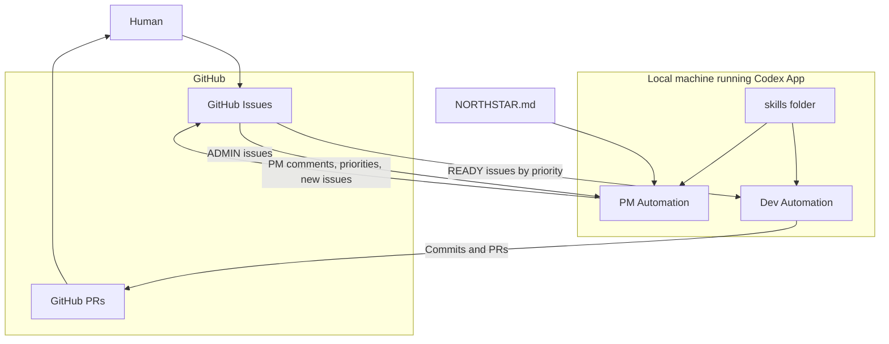

## Codex Agent Team Template

This repo is a **Codex Agent Team Template**, powered by **Codex Automations**.

It gives you a small team of agents (PM + one or more Devs) that:
- Use **GitHub issues and PRs** as their interface.
- Run on a **local machine that must be on and not sleeping**.
- Use **skills** in `skills/` and **automation prompts** in `automations/` to coordinate.

At a high level:
- **You (human)** create issues, comment on PRs, and approve/merge PRs.
- **PM agent** triages your issues and also creates new PM-labeled issues aligned with `NORTHSTAR.md`.
- **One or more Dev agents** pick up issues you mark `READY`, implement them, and open PRs. You can clone the Dev automation if you want multiple Devs working in parallel.

---

## Architecture (Mermaid)



## Getting started

### 1. Prerequisites

- **GitHub CLI (`gh`) installed**  
  - Follow GitHub’s instructions or, on macOS with Homebrew:
    ```bash
    brew install gh
    ```

- **Authenticate GitHub CLI**
  - In a terminal:
    ```bash
    gh auth login
    ```
  - Choose:
    - GitHub.com (most common)
    - HTTPS
    - “Login with a web browser”

Make sure `gh auth status` shows you’re logged in for this repo.

- **Keep a machine running** with the Codex app:
  - The automations run locally on your computer.
  - If your machine sleeps or is off, automations pause until it wakes up.
  - On macOS, you can keep the machine awake while you’re working by running:
    ```bash
    caffeinate
    ```

### 2. Clone this template into your project

You can:
- Use this repo as a **template** on GitHub (recommended), or
- Clone and adapt it manually:

```bash
git clone <this-repo-url> your-project
cd your-project
```

### 3. Create initial labels with `gh`

This template expects certain labels to exist in your GitHub repo:
- `ADMIN`
- `PM`
- `READY`
- `IN-PROGRESS`
- Priority labels: `high`, `medium`, `low`

You can create them with `gh` (run in your repo directory after `gh auth login`):

```bash
gh label create ADMIN --color "d73a4a" --description "Issues for PM triage"
gh label create PM --color "0e8a16" --description "PM-created issues"
gh label create READY --color "1d76db" --description "Ready for Dev to pick up"
gh label create IN-PROGRESS --color "fbca04" --description "Currently being implemented by Dev"

gh label create high --color "b60205" --description "High priority"
gh label create medium --color "dbab09" --description "Medium priority"
gh label create low --color "0e8a16" --description "Low priority"
```

If some labels already exist, `gh` will tell you; you can adjust colors/descriptions as you like.

### 4. Fill out `NORTHSTAR.md`

- Open `NORTHSTAR.md` in the repo root.
- Fill in:
  - Vision
  - North Star goal
  - Principles and guardrails
  - Scope (in / out)
  - Priority heuristics
- The PM and Dev automations read this document to align their behavior with your intent.

### 5. Configure automations in Codex

In the Codex app:

1. Go to **Automations**.
2. Create at least:
   - **PM automation** using `automations/pm.md`.
   - **One or more Dev automations** using `automations/dev.md` (you can clone the Dev automation if you want multiple Dev agents).
3. For each automation:
   - Select **this project** as the repo.
   - Choose **Worktree** (so implementation runs in an isolated worktree).
   - Set the **schedule** (see `automations/schedule.md` for suggested cadences).
   - Paste the prompt from the corresponding `automations/*.md` file.
4. Ensure the needed skills are available (e.g. `$pm-round`, `$dev-round` from `skills/public/`).

Once configured and your machine is running, the PM and Dev agents will:
- Watch your issues and labels.
- Triage ADMIN issues, assign priorities, and propose new work.
- Pick READY issues (by priority), implement them, and open PRs for you to review. If PM runs more often than Dev (especially with only one Dev automation), READY work may build up; you can respond by either increasing Dev’s cadence (for example Dev hourly vs PM every 2 hours) or cloning additional Dev automations so multiple Dev agents share the backlog.

You stay in control by:
- Editing `NORTHSTAR.md`,
- Adding/removing labels on issues,
- Reviewing and merging PRs.

---

## Optional: Easy deployment with Vercel

If your project includes a web app (for example a dashboard, status page, or docs site), an easy way to deploy it **without custom CI pipelines** is to use **Vercel’s “Import Git Repository”** flow:

- Push your repo to GitHub.
- In Vercel, choose **Import Git Repository** and select this repo.
- Choose the appropriate framework preset (or “Other” if none) and confirm the defaults.
- Vercel will:
  - Build and deploy on every push to the selected branch.
  - Provide preview URLs for PRs and a production URL for your main branch.

This keeps deployment simple while Codex automations focus on issues, PRs, and code changes rather than CI/CD setup.
