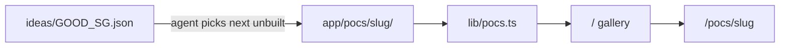

# Concepts for Good

A curated gallery of small, browser-based proof-of-concept apps built for Singapore — focused on access, care, resilience, and community.

Each concept is independently scoped, visually distinct, and demoable without a backend or account.

**[conceptsforgood.sg](https://conceptsforgood.sg)** &nbsp;·&nbsp; Built with Next.js, Claude, and Codex &nbsp;·&nbsp; By [Neil C](https://www.linkedin.com/in/neil-c)

---

## What's inside

17 live concepts across six themes:

| Theme | Examples |
|---|---|
| Urban access | Rain Window Planner, Carpark Chance, Traffic Camera Check |
| Accessibility | MRT Lift Note, Accessible Mall Route, Quiet Places |
| Community care | Senior Check-In, Elder Visit Planner |
| Health & ageing | Medication Reminder |
| Civic life | Volunteer Match, Skills for Good, Volunteer Hours |
| Cost of living | Rent Split Planner |

All POCs use seeded local data, `localStorage`, and persona-switch buttons — no auth, no server database.

---

## How it's structured



```
app/
├── layout.tsx          root metadata + fonts
├── page.tsx            gallery landing page
└── pocs/
    └── <slug>/
        ├── layout.tsx  per-page SEO metadata
        ├── page.tsx    POC app (client component)
        ├── data.ts     seed data + types
        └── page.module.css

lib/pocs.ts             card registry (title, summary, tags, theme)
ideas/GOOD_SG.json      idea bank — source of truth for new POCs
rules/                  mandatory design + content guidelines
automations/            Codex agent prompts (PM + Dev rounds)
skills/                 reusable agent skill definitions
```

---

## Running locally

**Requirements:** Node.js 18.20+

```bash
npm install
npm run dev        # http://localhost:3000
npm run build      # production build check
npm run lint       # eslint
npm run test       # vitest
```

---

## How new POCs get built

A Dev agent reads `ideas/GOOD_SG.json`, picks the first idea without `"built": true`, implements it as a Next.js POC, and opens a PR labelled `agent`. The PM agent handles backlog triage and idea prioritisation.

Design and content rules live in `rules/` — every POC must pass them before shipping.

---

## Contributing

See [CONTRIBUTING.md](./CONTRIBUTING.md).
